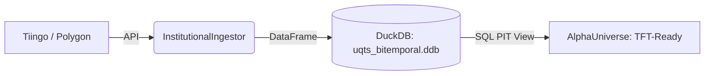

# QTS2026: Institutional Sniper-Residual Framework

## 0. Strategy Identity: "The Shield & The Sword"
QTS2026 is a high-performance execution framework for Long-Only Equity. It decouples Alpha generation (The Sword) from Macro Risk Management (The Shield).

*   **The Sword (RankNet):** A multi-modal Temporal Fusion Transformer that identifies the Top 5 most productive stocks using 16-scale Wavelet Spectrograms and Momentum dynamics.
*   **The Shield (RL Pilot):** A Reinforcement Learning Meta-Controller that toggles between 1.0x Exposure and 100% Cash based on 32 macro panic sensors.

## 1. System Architecture (V7.4.3)

### T+1 Execution Pipeline
The system enforces a strict **Sealed Envelope** protocol. Decisions made at the T=0 Close are frozen in Redis and executed at the T+1 Close via **Market-On-Close (MOC)** orders to ensure maximum institutional liquidity and noise-filtering.

### Data & Research


## 2. Key Capabilities
- **Institutional T+1 Logic**: Filters out 1-day noise; captures structural tides.
- **Retroactive Planning**: Self-healing boot logic allows solo traders to run the bot part-time without missing the 4:05 PM thinking window.
- **O(1) Telemetry**: optimized for multi-year performance benchmarking without latency.
- **Ferrari State Recovery**: Redis-backed persistence ensures charts and trade queues survive reboots.

## 3. End-to-End Operational Guide

### **Phase 1: Environment Setup**
```bash
git clone https://github.com/abhishek-jana/QTS2026.git
cd QTS2026
uv sync
```
*Ensure `.env` contains `ALPACA_API_KEY`, `ALPACA_SECRET_KEY`, and `TIINGO_API_KEY`.*

### **Phase 2: Signal Ingestion (Daily)**
The bot requires a 63-day historical lookback for its "Past Knowledge." Run this at least once a day after the market close.
```bash
python run.py signal ingest
```

### **Phase 3: Launch Mission Control**
Open two terminal tabs to start the dashboard:
```bash
# Tab 1: Backend
python run.py ui

# Tab 2: Dashboard (Open http://localhost:5173)
cd cockpit_frontend && npm run dev
```

### **Phase 4: Launch The Sniper (Live)**
Start the execution worker. It will automatically detect if a plan for today is missing and run a "Catch-Up" analysis.
```bash
python run.py live
```

## 4. Institutional Maintenance
To combat Alpha decay and Concept Drift, follow the **Quarterly Retraining Schedule** and monitor the **System Health Alarms** (Drawdown > -22%, IC Decay < 0.02).
*   See **`docs/OPERATIONS_MANUAL.md`** for the full deployment protocol and shadow-mode instructions.

## 5. Maintenance & Strategy Performance
- **Thinking Window**: 16:05 - 16:30 EST (AI generates tomorrow's plan).
- **Execution Window**: 15:50 - 16:00 EST (Worker dispatches MOC orders).
- **Verified Benchmark**: **+156.00%** Total Return ($265k final NLV) over 2024-2026.
- **Optimization Log**: Detailed engineering benchmarks are in `docs/RESEARCH_OPTIMIZATION_LOG.md`.

---
**Status: Blueprint V7.4.3 Synchronized. Institutional Grade Engaged.**
