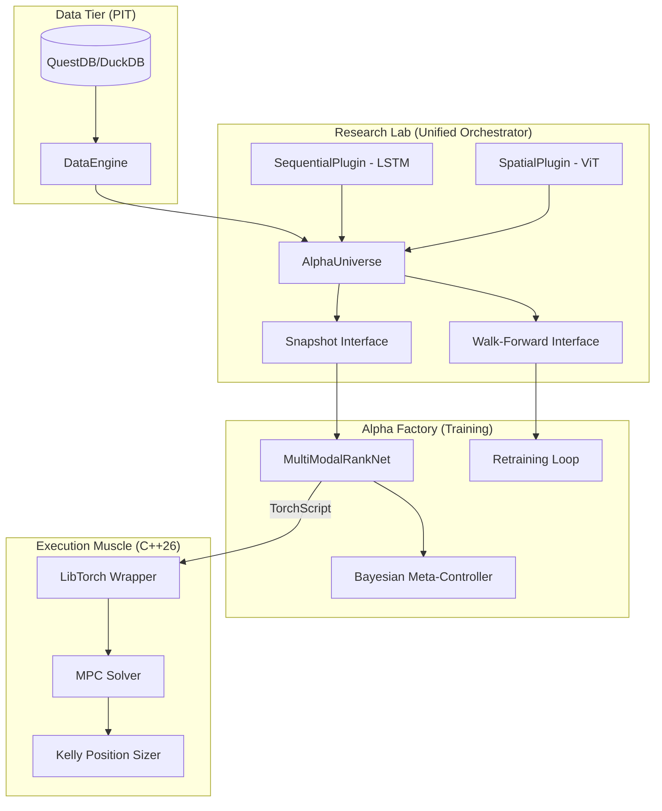

# UQTS-2026 (Unified Quant Training System)

## 0. Project Philosophy: "Signal vs. Fluid"
UQTS-2026 is a high-performance Long-Short Equity ranking platform. It treats market data as a non-stationary fluid requiring multi-resolution analysis (Wavelets) and memory preservation (Fractional Calculus).

## 1. System Architecture
The system follows a strict 3-tier evolution, synthesized into a **"Unified Lab"** orchestrator.



## 2. Key Capabilities
- **Bi-temporal Isolation**: Strict separation of *Event Time* and *Knowledge Time*.
- **Multi-Modal Fusion**: LSTM (Temporal Signal) + ViT (Spatial Signal) late fusion.
- **Plugin Architecture**: Add new modalities (Sentiment, GNNs) as isolated plugins.
- **Sub-100μs Muscle**: Native C++26 execution for theoretical alpha.

## 3. Setup & Execution

### **A. Prerequisites**
- `uv` (Fast Python package manager)
- `g++` (Supporting C++2b/26)
- `cmake`

### **B. Environment Initialization**
```bash
cd UQTS-2026
uv sync
```

### **C. Research: Alpha Discovery**
Visualize the signal physics and multi-modal windows.
```bash
uv run jupyter lab research_lab/alpha_discovery.ipynb
```
*   **Snapshot Test**: See how `universe.snapshot()` generates aligned tensors in one call.
*   **Spectrograms**: Inspect the Morlet wavelet scales.

### **D. Validation: Test Suite**
Ensure mathematical and architectural integrity.
```bash
uv run pytest
```
*   `tests/test_data_engine.py`: PIT Isolation & Correction logic.
*   `tests/test_alpha_universe.py`: Plugin alignment & Multi-modal shapes.
*   `tests/test_alpha_ranker.py`: RankNet convergence verification.
*   `tests/test_meta_controller.py`: Bayesian belief decay/growth.

### **E. Industrialization: RETRAIN Loop**
Verify signal physics (ADF tests) and retrain pipeline.
```bash
uv run python -m research_lab.verify_physics
```

### **F. Production: Execution Muscle**
Compile and run the high-performance C++ trade sizer.
```bash
cd execution_muscle
g++ -std=c++2b main.cpp -o muscle
./muscle
```

## 4. Directory Structure
- `/research_lab`: Alpha orchestrator, core math, and discovery notebooks.
- `/alpha_factory`: Retraining pipelines and Bayesian meta-controller.
- `/execution_muscle`: C++26 high-performance execution headers and bridge.
- `/tests`: Comprehensive TDD regression suite.
- `/docs`: Execution summary and articles.

---
**Signal vs. Fluid logic: ENGAGED.**
