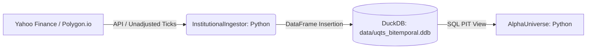
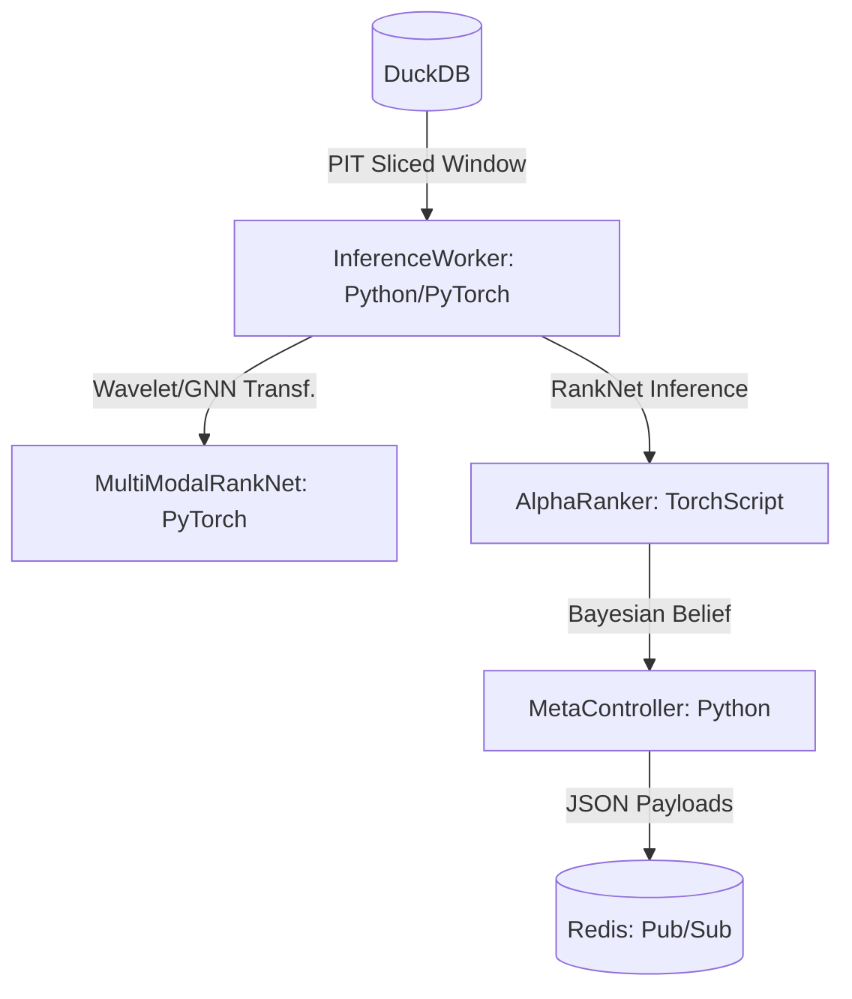
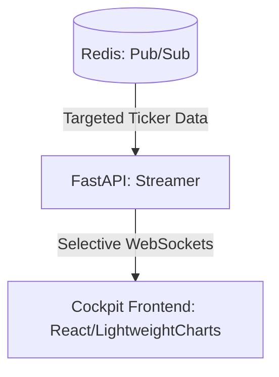

# QTS2026 (Unified Quant Training System)

## 0. Project Philosophy: "Signal vs. Fluid"
QTS2026 is a high-performance Long-Short Equity ranking platform. It treats market data as a non-stationary fluid requiring multi-resolution analysis (Wavelets), memory preservation (Fractional Calculus), and relational context (Graph Neural Networks).

## 1. System Architecture
The system follows a 3-tier production-grade architecture.

### Data Pipeline


### Research & Inference Pipeline


### UI Streaming Layer


## 2. Key Capabilities
- **Institutional Scale**: Handlers for 10k+ stocks via Batch PIT DataEngine decoupling.
- **Bi-temporal Isolation**: Strict separation of *Event Time* and *Knowledge Time*.
- **Triple-Modality Fusion**: LSTM (Temporal Signal) + ViT (Spatial Signal) + GNN (Relational/Sector Signal).
- **VRAM Optimizations**: Resident dataset residency in GPU for O(1) training throughput.
- **TorchScript Serialization**: Models serialized for cross-language consistency (Python -> C++).
- **Sub-100μs Muscle**: Native C++26 execution (experimental headers in `execution_muscle/`).

## 3. Key Dependencies
- **Core ML**: `torch`, `timm`, `einops`, `scikit-learn`
- **Math/Signal**: `numpy`, `pandas`, `scipy`, `statsmodels`, `pywavelets`
- **Infrastructure**: `duckdb`, `redis`, `loguru`
- **Web/UI**: `fastapi`, `uvicorn`, `streamlit`, `plotly`

## 4. Step-by-Step Implementation Guide

Follow this sequential workflow to initialize, verify, and deploy the QTS2026 platform.

### **Phase 1: Environment & Data**
1. **Initialize Project**:
   ```bash
   git clone https://github.com/your-username/QTS2026.git
   cd QTS2026
   uv sync
   ```
2. **Setup Credentials**:
   Create a `.env` file (see example in `docs/PRD_PRODUCTION_GRADE.md`).

### **Phase 2: Signal Physics Audit**
Verify the mathematical integrity of the signal pipeline (Stationarity & Spectral Energy).
```bash
uv run python -m research_lab.verify_physics
```

### **Phase 3: Backtest & Training**
Use the unified entry point for all research tasks.
```bash
# Run everything (Ingest + Train + Backtest)
uv run python run.py lab

# Run only training on existing data (2018-2022)
uv run python run.py lab --train

# Run a quick smoke test on 3 tickers (SPY, NVDA, TSM)
uv run python run.py lab --train --test-subset
```

### **Phase 4: Production Deployment**
Launch the inference worker and mission control.

1. **Start Inference Worker**:
   ```bash
   uv run python run.py prod
   ```
2. **Start UI Backend**:
   ```bash
   uv run python run.py ui
   ```

## 5. Maintenance & Operations
- **Observability**: System logs are stored in `logs/system.log` with automatic rotation.
- **Optimization Log**: Refer to **`docs/RESEARCH_OPTIMIZATION_LOG.md`** for performance baselines and the hardware roadmap.
- **Tests**: Run the full regression suite: `uv run pytest`.

## 6. Directory Structure
- `/research_lab`: Alpha orchestrator, core math, and discovery notebooks.
- `/alpha_factory`: Retraining pipelines and Bayesian meta-controller.
- `/execution_muscle`: Inference worker and C++ execution headers.
- `/cockpit_backend`: FastAPI WebSocket streamer.
- `/cockpit_frontend`: React/Tailwind high-density Mission Control.
- `/qts_core`: Centralized logging and shared infrastructure.
- `/data`: Local DuckDB storage and feature caches.
- `/models`: Serialized TorchScript binaries.

---
**Signal vs. Fluid logic: ENGAGED.**
