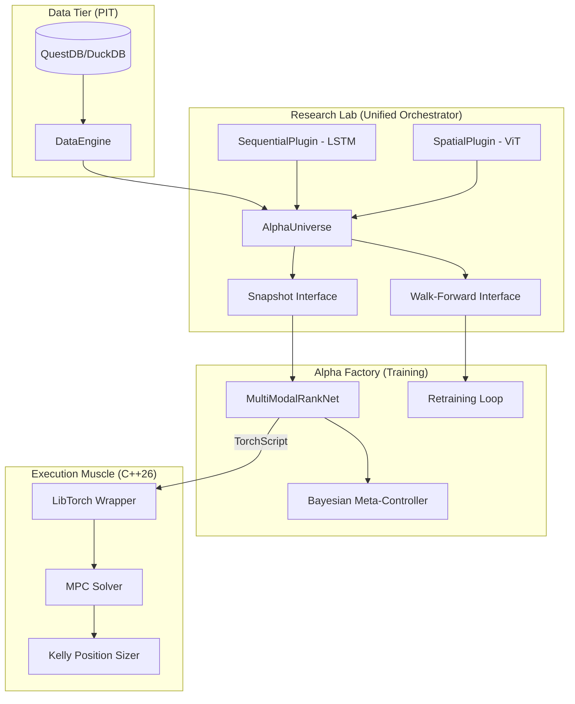

# UQTS-2026 (Unified Quant Training System)

## 0. Project Philosophy: "Signal vs. Fluid"
UQTS-2026 is a high-performance Long-Short Equity ranking platform. It treats market data as a non-stationary fluid requiring multi-resolution analysis (Wavelets) and memory preservation (Fractional Calculus).

## 1. System Architecture
The system follows a strict 3-tier evolution, synthesized into a **"Unified Lab"** orchestrator.



## 2. Key Capabilities
- **Bi-temporal Isolation**: Strict separation of *Event Time* and *Knowledge Time*.
- **Micro-Universe (20 Tickers)**: Diversified Tech, Semis, Financials, Energy, and Healthcare clusters + SPY benchmark.
- **Burn-In Stability**: 2-year "T-Minus 2" (2016-2018) buffer for Fractional Diff mathematical stability.
- **Multi-Modal Fusion**: LSTM (Temporal Signal) + ViT (Spatial Signal) late fusion.
- **TorchScript Serialization**: Models serialized via Tracing for cross-language consistency.
- **Sub-100μs Muscle**: Native C++26 execution for theoretical alpha.

## 3. Step-by-Step Implementation Guide

Follow this sequential workflow to initialize, verify, and deploy the UQTS-2026 platform.

### **Phase 1: Environment & Data**
1. **Initialize Project**:
   ```bash
   cd UQTS-2026
   uv sync
   ```
2. **Setup Credentials**:
   Create a `.env` file in the root directory:
   ```env
   ALPACA_API_KEY=your_key
   ALPACA_SECRET_KEY=your_secret
   ```

### **Phase 2: Signal Physics Audit**
Before training, verify the mathematical integrity of the signal pipeline (Stationarity & Spectral Energy).
```bash
uv run python -m research_lab.verify_physics
```
*   **Metric**: Ensure ADF p-values for stationary series are $< 0.05$.
*   **Interpretation**: Refer to the **"Physics Audit: Interpreting the Signal"** section in `docs/ARTICLE.md` for a guide on analyzing stationarity and scale activation energy.

### **Phase 3: Multi-Regime Backtesting**
Train the 'Champion' vs. 'Challenger' models on historical data (2016-2022) and evaluate on the 2023-Present Out-of-Sample regime.
```bash
uv run python research_lab/backtest_comparison.py
```
*   **Goal**: Verify that the Challenger (Multi-Modal) IC exceeds the Champion (Baseline).

### **Phase 4: High-Performance Serialization**
Export the trained model to TorchScript for C++ execution.
```bash
# This is typically automated within the training pipeline.
# To verify serialization manually:
uv run python -c "from research_lab.alpha_ranker import MultiModalRankNet; MultiModalRankNet(scales=32).export('model.pt')"
```

### **Phase 5: Production Muscle Compilation**
Compile the C++26 high-performance execution engine.
```bash
cd execution_muscle
g++ -std=c++2b main.cpp -o muscle
./muscle
```

### **Phase 6: Forward Testing (Paper Trading)**
Deploy the autonomous paper trading bot for live market evaluation.
```bash
# Set path and run module
export PYTHONPATH=$PYTHONPATH:.
uv run python -m execution_muscle.paper_bot
```
*   **Operational Tip**: Run this in a `tmux` session for persistent execution (see `DEPLOYMENT.md`).

### **Phase 7: Mission Control Monitoring**
Launch the visual cockpit to monitor live signals and meta-cognition metrics.

1. **Start Backend**:
   ```bash
   uv run python cockpit_backend/main.py
   ```
2. **Start Frontend**:
   ```bash
   cd cockpit_frontend
   npm run dev
   ```
   Navigate to `http://localhost:5173`. **Click any ticker** in the Ranking Grid to update the Spectral Viewer in real-time.

## 4. Maintenance & Operations
- **Configuration**: All tunable parameters (Universe, $d$ parameter, thresholds) are managed in `config.yaml`.
- **SOP**: For professional 1-week deployment instructions, refer to **`DEPLOYMENT.md`**.
- **Tests**: Run the full regression suite before any major change: `uv run pytest`.

## 4. Directory Structure
- `/research_lab`: Alpha orchestrator, core math, and discovery notebooks.
- `/alpha_factory`: Retraining pipelines and Bayesian meta-controller.
- `/execution_muscle`: C++26 high-performance execution headers and bridge.
- `/cockpit_backend`: FastAPI WebSocket streamer for live UI data.
- `/cockpit_frontend`: React/Tailwind high-density Mission Control.
- `/tests`: Comprehensive TDD regression suite.
- `/docs`: Execution summary and articles.

---
**Signal vs. Fluid logic: ENGAGED.**
