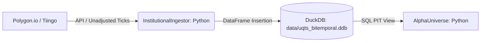
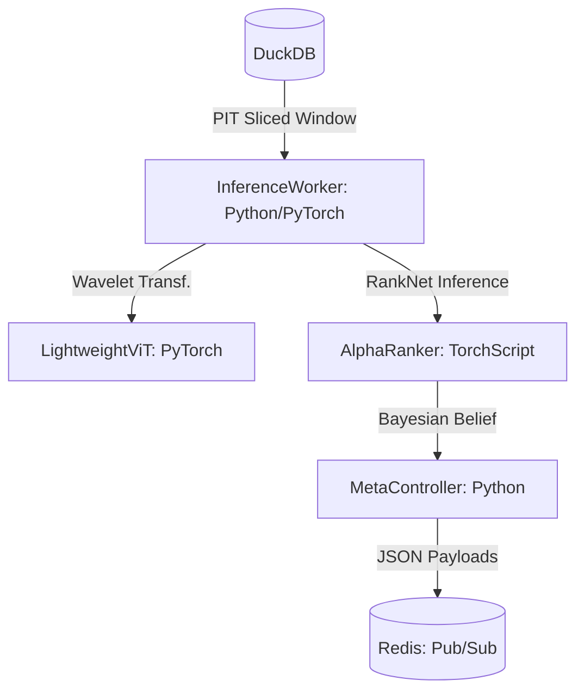
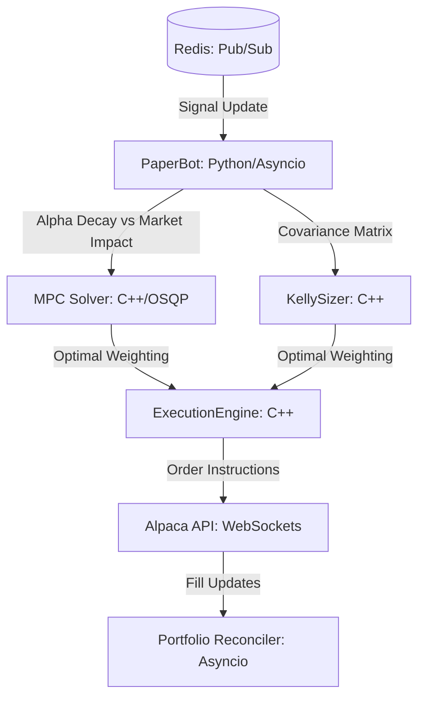
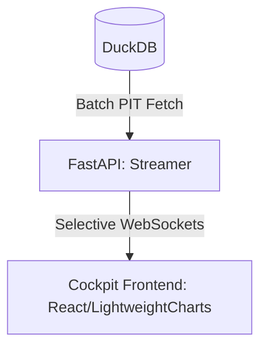

# QTS2026 (Unified Quant Training System)

## 0. Project Philosophy: "Signal vs. Fluid"
QTS2026 is a high-performance Long-Short Equity ranking platform. It treats market data as a non-stationary fluid requiring multi-resolution analysis (Wavelets) and memory preservation (Fractional Calculus).

## 1. System Architecture
The system follows a 3-tier production-grade architecture.

### Data Pipeline


### Research & Inference Pipeline


### Execution Muscle Pipeline


### UI Streaming Layer


## 2. Key Capabilities
- **Institutional Scale**: Handlers for 10k+ stocks via Batch PIT DataEngine decoupling.
- **Bi-temporal Isolation**: Strict separation of *Event Time* and *Knowledge Time*.
- **Micro-Universe (20 Tickers)**: Diversified Tech, Semis, Financials, Energy, and Healthcare clusters + SPY benchmark.
- **Burn-In Stability**: 2-year "T-Minus 2" (2016-2018) buffer for Fractional Diff mathematical stability.
- **Multi-Modal Fusion**: LSTM (Temporal Signal) + ViT (Spatial Signal) late fusion.
- **TorchScript Serialization**: Models serialized via Tracing for cross-language consistency.
- **Sub-100μs Muscle**: Native C++26 execution for theoretical alpha.

## 3. Key Dependencies
- **Core ML**: `torch`, `timm`, `scikit-learn`, `einops`
- **Math/Signal**: `numpy`, `pandas`, `scipy`, `statsmodels`, `pywavelets`
- **Data/Cache**: `duckdb`, `redis`, `yfinance`, `alpaca-trade-api`, `polygon-api-client`
- **Backend/UI**: `fastapi`, `uvicorn`, `streamlit`, `plotly`

## 4. Step-by-Step Implementation Guide

Follow this sequential workflow to initialize, verify, and deploy the QTS2026 platform.

### **Phase 1: Environment & Data**
1. **Initialize Project**:
   ```bash
   git clone https://github.com/your-username/QTS2026.git
   cd QTS2026
   uv sync
   ```
2. **Setup Credentials**:
   Create a `.env` file in the root directory:
   ```env
   ALPACA_API_KEY=your_key
   ALPACA_SECRET_KEY=your_secret
   ```

### **Phase 2: Signal Physics Audit**
Before training, verify the mathematical integrity of the signal pipeline.
```bash
uv run python -m research_lab.verify_physics
```

### **Phase 3: Multi-Regime Backtesting**
Train and evaluate the models using the professional entry point.
```bash
# Run everything (Ingest + Train + Backtest)
uv run python run.py lab

# Run only training on existing data
uv run python run.py lab --train

# Run a quick smoke test on 3 tickers
uv run python run.py lab --train --test-subset
```

### **Phase 4: Production Muscle Monitoring**
Launch the production worker and visual cockpit.

1. **Start Inference Worker**:
   ```bash
   uv run python run.py prod
   ```
2. **Start Backend Server**:
   ```bash
   uv run python run.py ui
   ```
3. **Start Frontend**:
   ```bash
   cd cockpit_frontend
   npm run dev
   ```
   Navigate to `http://localhost:5173`. **Click any ticker** in the Ranking Grid to update the Spectral Viewer in real-time.

## 5. Maintenance & Operations
- **Configuration**: All tunable parameters (Universe, $d$ parameter, thresholds) are managed in `config.yaml`.
- **SOP**: For professional 1-week deployment instructions, refer to **`DEPLOYMENT.md`**.
- **Tests**: Run the full regression suite before any major change: `uv run pytest`.

## 6. Directory Structure
- `/research_lab`: Alpha orchestrator, core math, and discovery notebooks.
- `/alpha_factory`: Retraining pipelines and Bayesian meta-controller.
- `/execution_muscle`: C++26 high-performance execution headers and bridge.
- `/cockpit_backend`: FastAPI WebSocket streamer for live UI data.
- `/cockpit_frontend`: React/Tailwind high-density Mission Control.
- `/data`: Local DuckDB storage and pre-processed feature caches.
- `/models`: Serialized TorchScript binaries ready for production.
- `/tests`: Comprehensive TDD regression suite.
- `/docs`: Execution summary and articles.

---
**Signal vs. Fluid logic: ENGAGED.**
