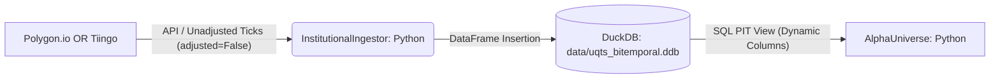
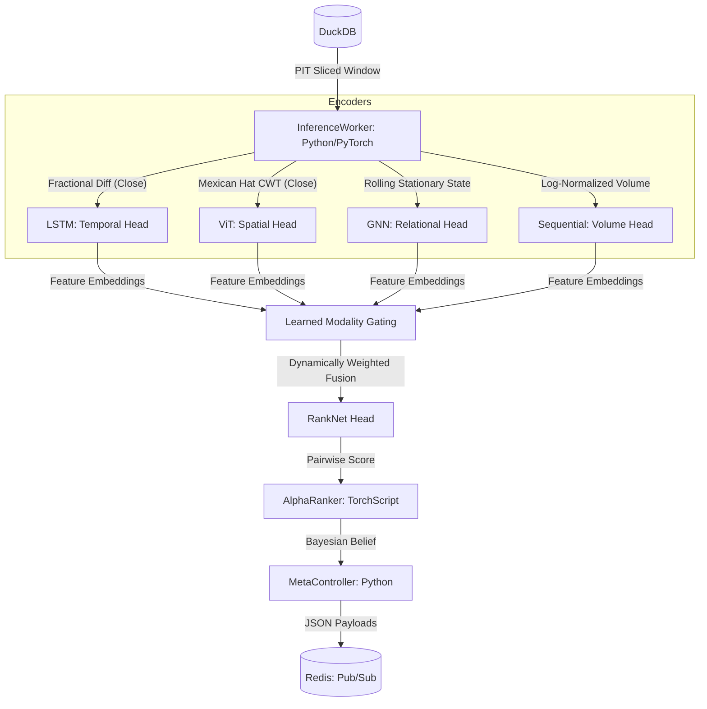
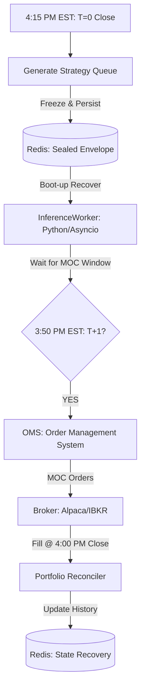
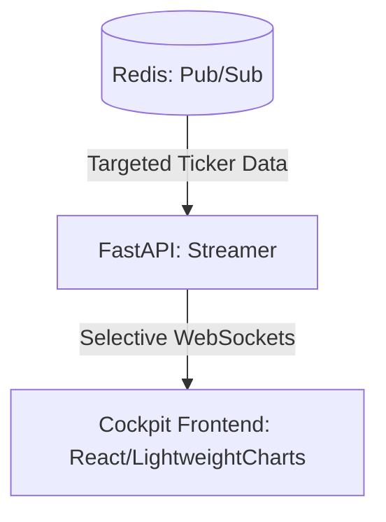

# Architectural Diagrams: UQTS-2026 Production-Grade

## 1. Data Ingestion & Storage Pipeline


## 2. Research & Inference Pipeline (Quad-Modality)


## 3. The "Shield & Sword" Architecture (V7.4.3)
```mermaid
graph TD
    subgraph Sword: Alpha Engine (RankNet)
        A[60-Ticker Universe] -- "63-Day PIT Window" --> B[Temporal Fusion Transformer]
        B -- "Cross-Sectional Ranking" --> C[Top 5 Picks]
    end
    
    subgraph Shield: Macro Risk (RL Pilot)
        D[32-Sensor Observation] -- "VIX, Vol_Vel, RSI, Drawdown" --> E[PPO Policy Pilot]
        E -- "Exposure Decision" --> F[0.0x or 1.0x Leverage]
    end
    
    C & F -- "Fused Intelligence" --> G[Strategy Queue: T+1 Plan]
    G -- "JSON Serialize" --> H[(Redis: pending_decision)]
```

## 4. T+1 Execution Muscle Pipeline


## 5. UI Streaming Layer

