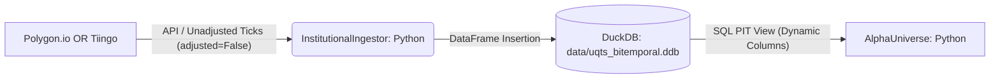
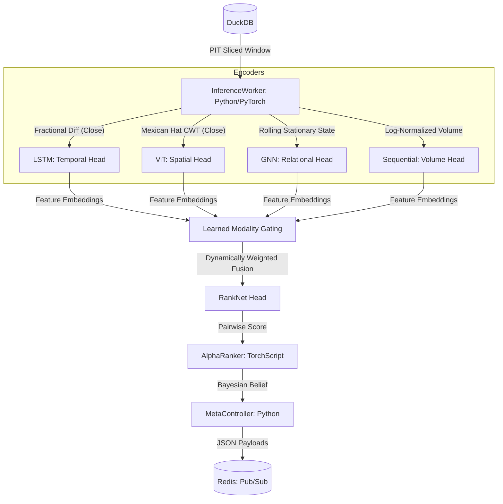
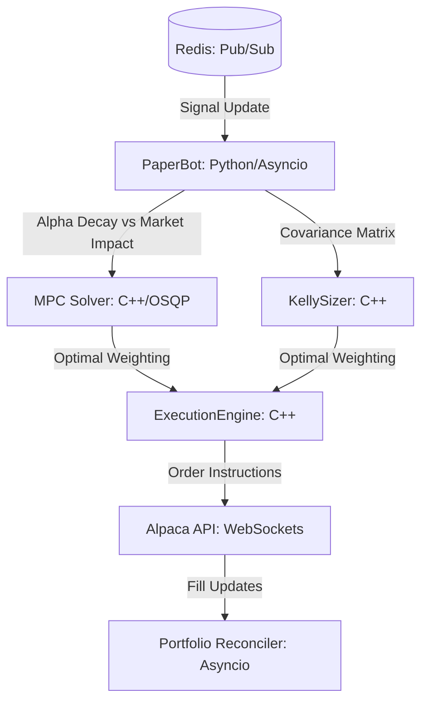
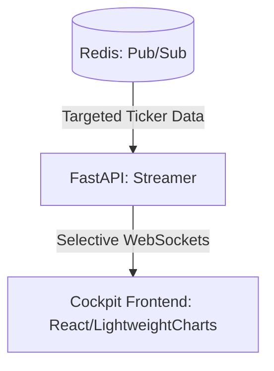

# Architectural Diagrams: UQTS-2026 Production-Grade

## 1. Data Ingestion & Storage Pipeline

## 2. Research & Inference Pipeline (Quad-Modality)

## 3. Execution Muscle Pipeline

## 4. UI Streaming Layer

