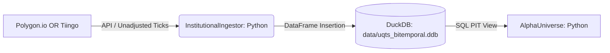
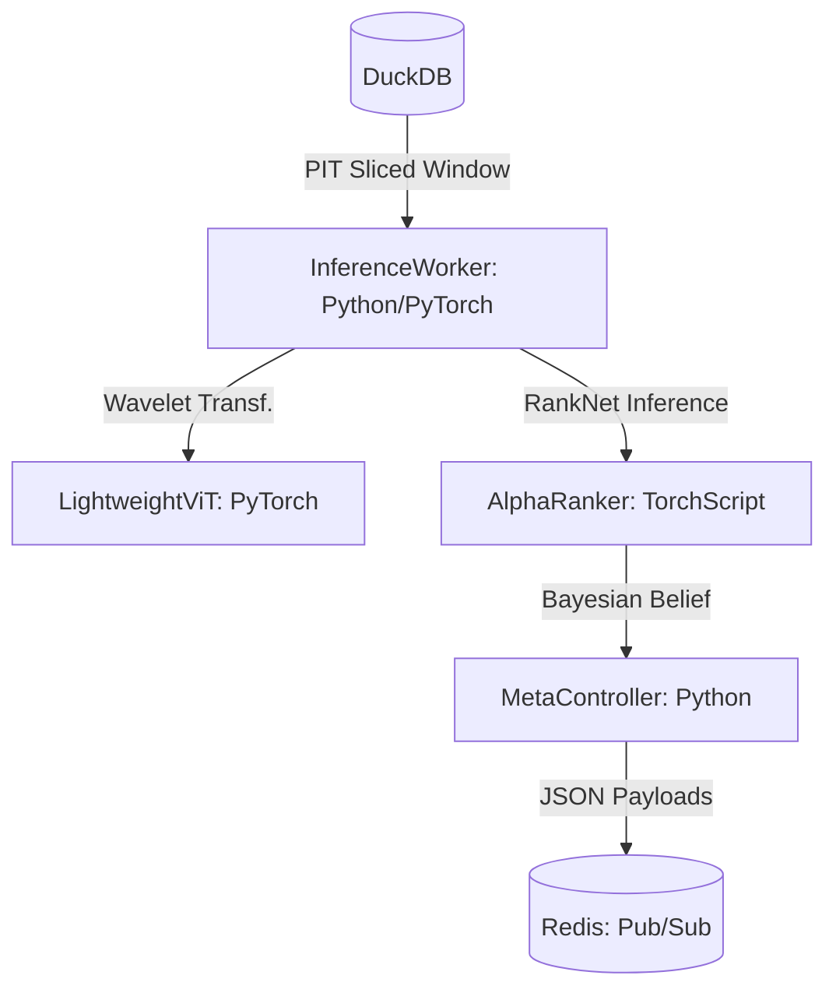
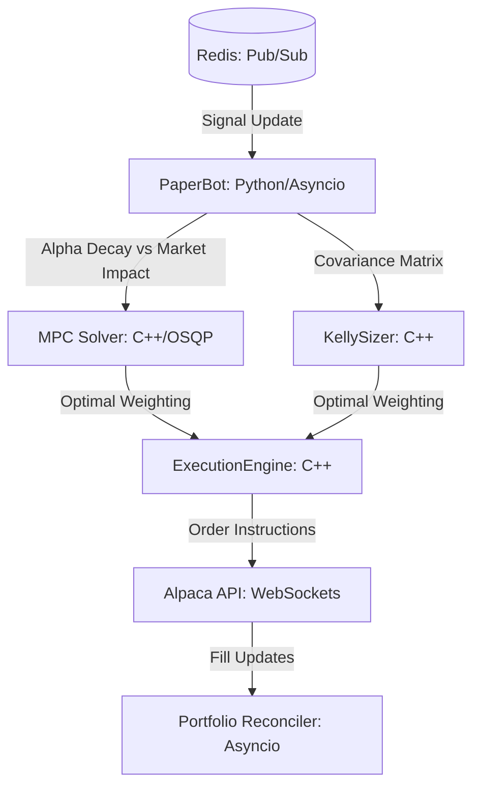
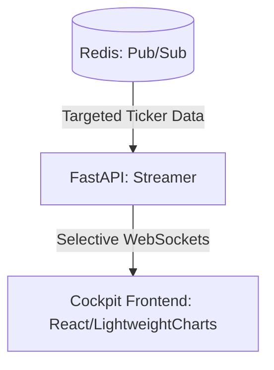

# Architectural Diagrams: UQTS-2026 Production-Grade

## 1. Data Ingestion & Storage Pipeline

```mermaid
graph LR
    A[Polygon.io OR Tiingo] -- API / Unadjusted Ticks --> B(InstitutionalIngestor: Python)
    B -- DataFrame Insertion --> C[(DuckDB: data/uqts_bitemporal.ddb)]
    C -- SQL PIT View --> D[AlphaUniverse: Python]
```

## 2. Research & Inference Pipeline

```mermaid
graph TD
    A[(DuckDB)] -- "PIT Sliced Window" --> B[InferenceWorker: Python/PyTorch]
    B -- Wavelet Transf. --> C[LightweightViT: PyTorch]
    B -- RankNet Inference --> D[AlphaRanker: TorchScript]
    D -- Bayesian Belief --> E[MetaController: Python]
    E -- JSON Payloads --> F[(Redis: Pub/Sub)]
```

## 3. Execution Muscle Pipeline

```mermaid
graph TD
    A[(Redis: Pub/Sub)] -- Signal Update --> B[PaperBot: Python/Asyncio]
    B -- Covariance Matrix --> C[KellySizer: C++]
    B -- Alpha Decay vs Market Impact --> D[MPC Solver: C++/OSQP]
    D & C -- Optimal Weighting --> E[ExecutionEngine: C++]
    E -- Order Instructions --> F[Alpaca API: WebSockets]
    F -- Fill Updates --> G[Portfolio Reconciler: Asyncio]
```

## 4. UI Streaming Layer

```mermaid
graph TD
    A[(Redis: Pub/Sub)] -- Targeted Ticker Data --> B[FastAPI: Streamer]
    B -- Selective WebSockets --> C[Cockpit Frontend: React/LightweightCharts]
```
