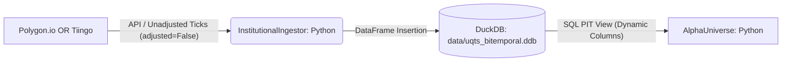
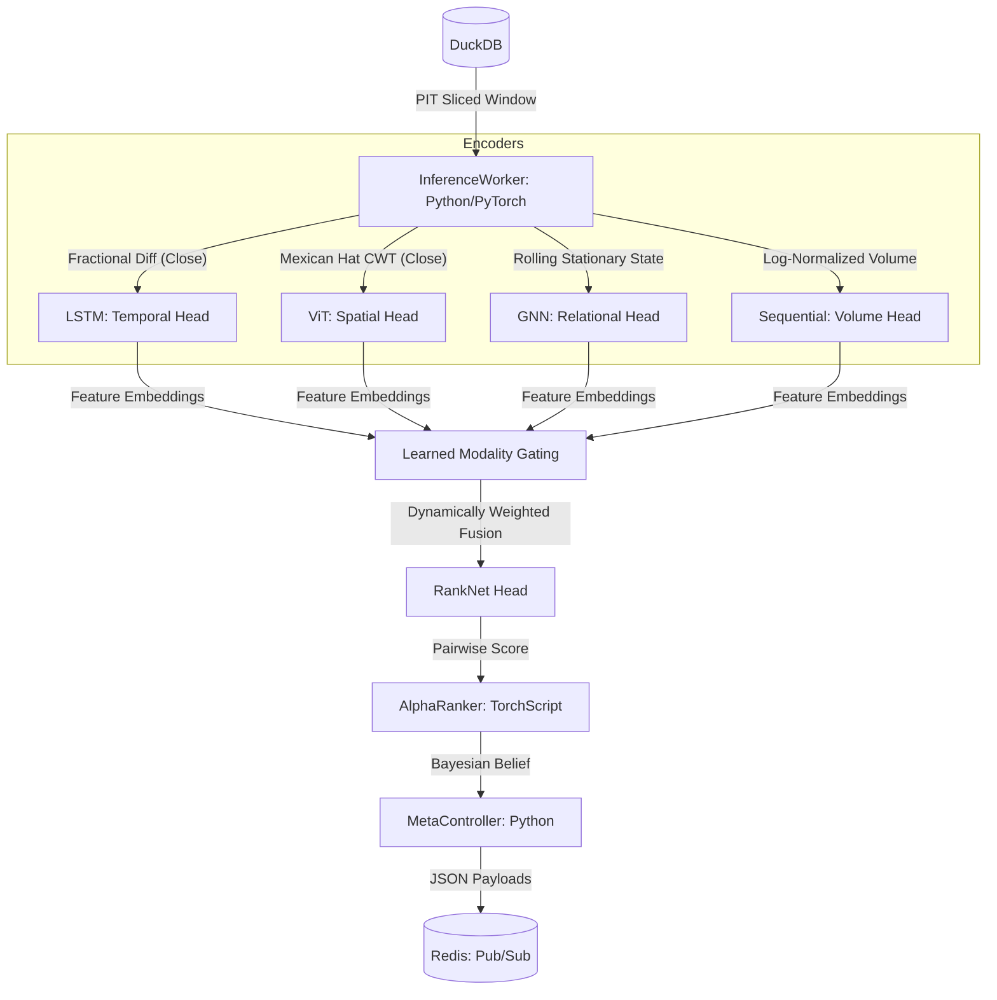
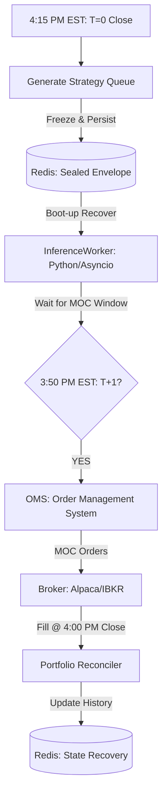

# Architectural Diagrams: UQTS-2026 Production-Grade

## 1. Data Ingestion & Storage Pipeline


## 2. Research & Inference Pipeline (Quad-Modality)


## 3. The "Shield & Sword" Architecture (V7.4.3)
```mermaid
graph TD
    subgraph Sword: Alpha Engine (RankNet)
        A[60-Ticker Universe] -- "63-Day PIT Window" --> B[Temporal Fusion Transformer]
        B -- "Cross-Sectional Ranking" --> C[Top 5 Picks]
    end
    
    subgraph Shield: Macro Risk (RL Pilot)
        D[32-Sensor Observation] -- "VIX, Vol_Vel, RSI, Drawdown" --> E[PPO Policy Pilot]
        E -- "Exposure Decision" --> F[0.0x or 1.0x Leverage]
    end
    
    C & F -- "Fused Intelligence" --> G[Strategy Queue: T+1 Plan]
    G -- "JSON Serialize" --> H[(Redis: pending_decision)]
```

## 4. T+1 Execution Muscle Pipeline


## 6. The "Tri-Brain" Decoupled Logic
This diagram illustrates the operational separation of thinking (AI/RL) and execution (Bot). Each module is isolated to ensure system stability and prevent logic interference.

```mermaid
graph TD
    subgraph The Thinking Brain (The Cloud/Server)
        A[Analyst: RankNet AI] -- "Signal: 60-Stock Ladder" --> C[Inference Translation]
        B[Captain: RL Pilot] -- "Decision: 1.0x / Top 5 / Sniper" --> C
    end

    subgraph The Memory Layer (Persistence)
        C -- "Write Weights % (No thinking)" --> D[(Redis: Sealed Envelope)]
    end

    subgraph The Execution Muscle (Local/Paper)
        D -- "Read Weights % at 3:50 PM" --> E[Mechanic: PaperBot]
        F[Live Price Feed] -- "Get Penny Price" --> E
        E -- "Mechanical Order: (Weights * Budget) / Price" --> G[Broker: Alpaca/IBKR]
    end

    subgraph Operational Roles
        RoleA[Analyst: Sees Alpha, ignores dollars]
        RoleB[Captain: Sees profit/risk, ignores tickers]
        RoleC[Mechanic: Sees orders/penny prices, ignores strategy]
    end
```
